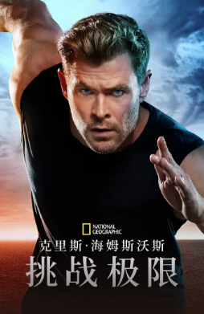

## 克里斯·海姆斯沃斯：挑战极限

* <button class="btn btn-link" onclick="play('https://s.xlzys.com/play/qaQ6lvGb/index.m3u8')">克里斯·海姆斯沃斯：挑战极限01</button>
* <button class="btn btn-link" onclick="play('https://s.xlzys.com/play/BeXrvnvb/index.m3u8')">克里斯·海姆斯沃斯：挑战极限02</button>
* <button class="btn btn-link" onclick="play('https://s.xlzys.com/play/rb27POMd/index.m3u8')">克里斯·海姆斯沃斯：挑战极限03</button>
* <button class="btn btn-link" onclick="play('https://s.xlzys.com/play/9b6Bl2Ob/index.m3u8')">克里斯·海姆斯沃斯：挑战极限04</button>
* <button class="btn btn-link" onclick="play('https://s.xlzys.com/play/Xe00NO5e/index.m3u8')">克里斯·海姆斯沃斯：挑战极限05</button>
* <button class="btn btn-link" onclick="play('https://s.xlzys.com/play/nel2lDjb/index.m3u8')">克里斯·海姆斯沃斯：挑战极限06</button>

